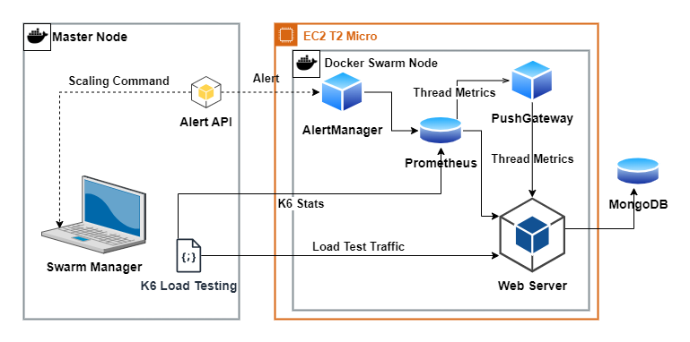
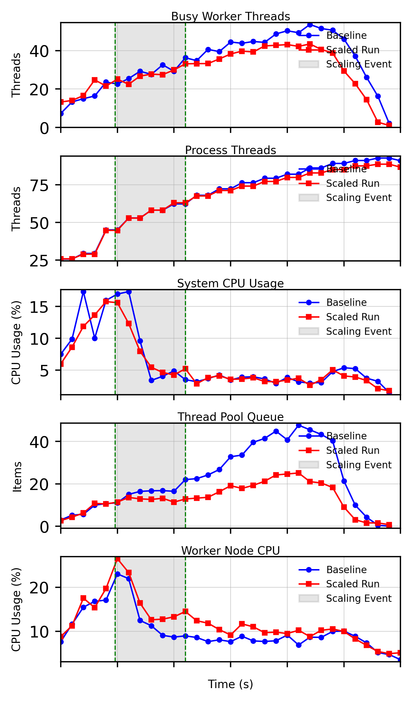
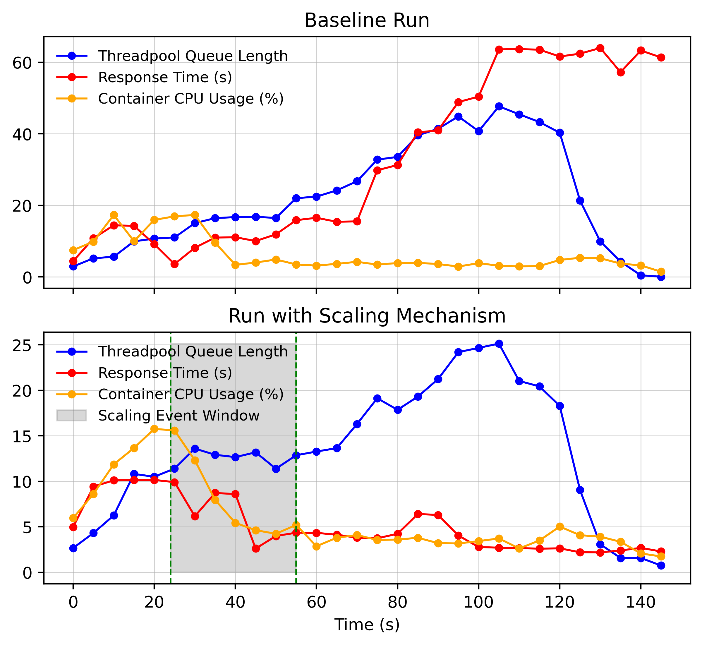

# ISSC - Enhancing Performance and Scalability in Containerised Environments

This repository provides the source code used during the implementation phase of a Docker Swarm-based system presented at ISSC 2025 conference for the paper - `Enhancing Performance and Scalability in Containerised Environments`. Below you'll find instructions to replicate the environment, deploy the system, and run automated tests.

## Table of Contents

- [ISSC - Enhancing Performance and Scalability in Containerised Environments](#issc---enhancing-performance-and-scalability-in-containerised-environments)
  - [Table of Contents](#table-of-contents)
- [Implementation](#implementation)
  - [Docker Swarm Setup](#docker-swarm-setup)
    - [Master Node Installation (Ubuntu 22.04)](#master-node-installation-ubuntu-2204)
      - [Initialize Docker Swarm](#initialize-docker-swarm)
      - [Configure Port Forwarding](#configure-port-forwarding)
    - [Worker Node Setup (AWS EC2)](#worker-node-setup-aws-ec2)
  - [System Under Test (SUT)](#system-under-test-sut)
  - [Monitoring Infrastructure](#monitoring-infrastructure)
  - [Prometheus Configuration](#prometheus-configuration)
  - [AlertManager Setup](#alertmanager-setup)
  - [Grafana Visualization](#grafana-visualization)
  - [Scaling Mechanism](#scaling-mechanism)
  - [Load Testing](#load-testing)
  - [Deployment](#deployment)
    - [Deployed System Architecture](#deployed-system-architecture)
  - [Metrics Export](#metrics-export)
  - [Automation](#automation)
  - [Figure Generation](#figure-generation)
  - [IAC](#iac)
    - [Prerequisites](#prerequisites)
    - [Steps](#steps)

# Implementation

## Docker Swarm Setup

### Master Node Installation (Ubuntu 22.04)

Install Docker and Docker Compose using the following commands:

```bash
sudo -v
sudo apt-get -y install ca-certificates curl gnupg
sudo install -m 0755 -d /etc/apt/keyrings
curl -fsSL https://download.docker.com/linux/ubuntu/gpg | sudo gpg --dearmor -o /etc/apt/keyrings/docker.gpg
sudo chmod a+r /etc/apt/keyrings/docker.gpg
echo \
  "deb [arch=$(dpkg --print-architecture) signed-by=/etc/apt/keyrings/docker.gpg] https://download.docker.com/linux/ubuntu \
  $(. /etc/os-release && echo "$VERSION_CODENAME") stable" | \
  sudo tee /etc/apt/sources.list.d/docker.list > /dev/null
sudo apt-get -y update
sudo apt-get -y install docker-ce docker-ce-cli containerd.io docker-buildx-plugin docker-compose-plugin
sudo usermod -aG docker $USER
exec su -l $USER
docker --version
```

#### Initialize Docker Swarm

Initialize Docker Swarm on the master node:

```bash
docker swarm init
```

The command will provide a token for worker nodes to join the swarm.

#### Configure Port Forwarding

Ports required by Docker Swarm:

| Usage                 | Port | Protocol |
|-----------------------|------|----------|
| Overlay Network       | 4789 | UDP      |
| Node Communication    | 7946 | UDP & TCP|
| Cluster Management    | 2377 | TCP      |
| AlertAPI              | 5001 | TCP      |

Configure firewall rules:

```bash
sudo ufw allow 4789/udp
sudo ufw allow 7946/tcp
sudo ufw allow 7946/udp
sudo ufw allow 2377/tcp
sudo ufw allow 5001/tcp
sudo ufw status
```

### Worker Node Setup (AWS EC2)

- Deploy an AWS EC2 instance using Ubuntu 22.04 (AMI: ubuntu-jammy-22.04-amd64-server-20240207.1  ID: ami-0d940f23d527c3ab1).
- Configure security group rules to allow inbound traffic:

| Service      | Port  |
|--------------|-------|
| SSH          | 22    |
| Grafana      | 3000  |
| SUT          | 5000  |
| Prometheus   | 9090  |
| PushGateway  | 9091  |
| AlertManager | 9093  |

- Install Docker on the worker node following the same steps as the master node.
- Add a DNS entry in AWS Route53 for worker node accessibility.
- Join the worker node to the swarm using the token from the master node:

```bash
docker swarm join --token <TOKEN> <MASTER_NODE_IP>:2377
```

## System Under Test (SUT)

The SUT is a minimal API using .NET 8.0 that simulates workload, integrates MongoDB for storage, and reports metrics via a PushGateway. It listens on port `5000`. Build the image and push to a container registry in order to use the service in docker swarm. Update the docker compose file as needed.

## Monitoring Infrastructure

Monitoring tools deployed:

| Service        | Purpose                                         |
|----------------|-------------------------------------------------|
| Prometheus     | Scrape metrics and send alerts                  |
| PushGateway    | Aggregates metrics for Prometheus scraping      |
| AlertManager   | Handles alert notifications                     |
| NodeExporter   | Collects hardware/OS metrics                    |
| Grafana        | Visualizes collected metrics                    |

## Prometheus Configuration

Configured scrape intervals and alerting rules:

- **Scrape intervals:** 10 seconds globally; PushGateway interval is 1 second.
- **Alert rules:**
  - **ThreadPool Spike**: Alerts when queue length reaches 40.
  - **ThreadPool Starvation**: Alerts if queue length stays above 20 for 5 seconds.

## AlertManager Setup

Configured via webhook to forward alerts to:

```yaml
route:
  receiver: 'webhook-receiver'
  group_wait: 1s
receivers:
  - name: 'webhook-receiver'
    webhook_configs:
      - url: 'http://alertapi.mahoney0101.com:5001/alert'
```

## Grafana Visualization

Deployed for data visualization on port `3000`.

## Scaling Mechanism

Autoscaling via a Flask API (`AlertAPI`) listening on port `5001`. Scales services dynamically based on alerts.

## Load Testing

Load testing performed using K6 Spike Test:

```bash
k6 run --env K6_PROMETHEUS_RW_SERVER_URL=http://threads.mahoney0101.com:9090/api/v1/write --env K6_OUT=prometheus-rw --env K6_PROMETHEUS_RW_TREND_AS_NATIVE_HISTOGRAM=true -o experimental-prometheus-rw --tag testid=threadloadtest ./k6/k6_from_master.js
```

## Deployment

Deploy services using Docker Stack with placement constraints:

- Tag nodes:

```bash
docker node update --label-add role=worker <node ID>
docker node update --label-add role=master <node ID>
```

- Create Docker configurations:

```bash
docker config create prometheusconfig ./prometheus/prometheus.yml
docker config create prometheusalertrulesconfig ./prometheus/alert rules.yml
docker config create alertmanagerconfig ./alertmanager/config.yml
```

- Deploy stack:

```bash
docker stack deploy -c docker-compose.yml <STACK_NAME>
```

### Deployed System Architecture



## Metrics Export

Metrics are exported and visualized using Python scripts querying Prometheus and generating plots via Matplotlib.

## Automation

Testing is automated using a bash script that:

- Configures swarm nodes
- Deploys stack
- Executes K6 load tests
- Exports the metrics

Execute automation script:

```bash
./entrypoint.sh
```

## Figure Generation

There are scripts to generate figures in the figures/figure_generation directory






## IAC

To simplify worker node creation, the provided Terraform code in ./terraform/main.tf will automate the provisioning and configuration of worker EC2 instance, including automatic registration with the Docker Swarm cluster, and ssh key generation and registration.

### Prerequisites

- terraform installed
- aws cli installed

### Steps

- Ensure port forwarding [is setup](#configure-port-forwarding)
- Configure awscli profile by running `aws configure --profile issc`
- Run `docker swarm init  --listen-addr <private_ip>:2377 --advertise-addr <public_ip>` this will output a join token
- Add the join token and the public_ip to ssm by running the following
  - aws ssm put-parameter --name "swarm-join-token" --value "<join_token>" --type "String" --profile issc --overwrite
  - aws ssm put-parameter --name "master_ip" --value "<public_ip>" --type "String" --profile issc --overwrite

- Navigate to ./terraform and run the following
  - `terraform apply` confirm all is as expected and approve
  
Worker node should be running and part of the swarm, run `docker node ls` to verify connectivity
